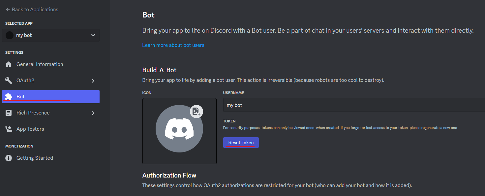

# MessageTransporter
## はじめに
MessageTransporterは、ゲーム中にシームレスにDiscordのメッセージをやり取りしたいという思いを元に作られたメッセージ転送アプリです。
ゲーム中にコミュニケーションを取ることを目的としており、大きく2つの機能を提供します。

- Discordなどのコミュニケーションツールのメッセージを送受信する
- テキストを音声変換する

MessageTransporterは外部ツールに依存しています。そのため、利用者にて外部ツールのセットアップが必要となります。
簡易的なセットアップ方法は本ドキュメントに記載していますが、細かいセットアップ方法については各種ツールのドキュメントをご確認ください。
また、外部ツールの利用については各ツールの規約を守って使用してください。

## 機能
### Discordのテキストチャット取得・テキスト投稿
Discordのbotを使用してテキストチャットの取得・テキストの投稿ができます。
テキストチャットの取得はbotが参加しているサーバのすべてのテキストチャットを取得します。
> ⚠️将来的には取得するテキストチャットを絞り込む機能を追加する予定です

botを使用している関係で、サーバの管理者にbotを許可してもらう必要があります。

### Twitchのチャット取得・テキスト投稿
TwitchのAPIを利用してテキストチャットの取得・テキストの投稿ができます。
テキストチャットの取得は指定したユーザのチャットを取得します。複数のユーザのチャットを取得することも可能です。

TwitchのAPIを利用するため、Twitchのアプリ登録と認証が必要となります。

### VOICEVOXを使ったTextToSpeak機能
VOICEVOXと連携することで、テキストを音声に変換できます。
自分の入力するテキストの他、DiscordやTwitchのテキストも音声に変換可能です。

VOICEVOXとの連携はVOICEVOXのWEP APIを利用しています。 VOICEVOXをあらかじめ起動させておくことで連携が可能です。

### ゲームウインドウ上に表示し、ホットキーで入力する
ゲーム中にシームレスに操作できるよう、画面の最上位に表示しています。
また、不用意にマウスカーソルがあってアクティブにならないようにするため、マウスが使用できない仕組みとなっています。
ホットキーを入力することでテキストボックスにカーソルが移り、テキストが入力できるようになります。

## インストール
MessageTransporterはexeのみ配布の形式です。
以下のURLからexeを取得して起動してください。

> リリースしてから設定する

## 基本操作
MessageTransporterはゲーム中に操作することを想定しています。
そのため、通常のウィンドウとは動作が異なります。
操作するときはホットキーやコマンドを使用します。

### テキストの入力
テキストボックスへのホットキーは初期設定では`Ctrl + Enter`です。

### ウィンドウの移動
テキストボックスに`:window move`と入力することでウィンドウを移動できる状態となります。
移動後は再度`:window move`と入力することで、ウィンドウを固定します。

### ウィンドウサイズの変更
ウィンドウサイズは数値入力で設定します。
テキストボックスに`:window size {width} {height}`と入力することでウィンドウサイズが変更できます。
`{width}`と`{height}`は整数で、ピクセルを入力します。

ex: `:window size 380 400`

## セットアップ
MessageTransporterはUIを簡素にしているため、設定用のUIがありません。
代わりにテキストボックスにコマンドを入力することが可能です。
MessageTransporterとの連携箇所については、 コマンドを入力してセットアップします。

### Discord
DiscordはAPIを提供していない代わりにBotを使用することでサーバのメッセージを読み書きできます。
自分でBotを作成し登録するため、以下の制約があります。
- サーバ管理者にBotを許可してもらう必要があります。
- テキストを投稿する場合、Botが発言します。
- Botが参照できるテキストチャンネルのみメッセージが取得できます。
- 個人間チャットは取得できません。

1. Discordの開発者機能をONにします。

> 必須ではないですが、設定時に利用する場合があるので事前にONにするのがよいです。

1. Discordの開発者ポータルにアクセスします。
[Discord 開発者ポータル](https://discord.com/developers/applications)

1. applicationsの右側にある"New Application"ボタンをクリックする


1. アプリケーション名を入力し、規約の同意チェックボックスをオンにし、アプリケーションを作成します。  アプリケーション名はBotの名前になるため、他の人が認識できる名前にするとよいです。


1. アプリケーションの設定ページから左側ペインのBotを選択し、ResetTokenをクリックします。  トークンが再発行されるので、メモしてください。
> トークンが漏洩するとBotに不正アクセスできる状態となります。トークンの管理には細心の注意を払ってください。


1. 左側ペインのOAuth2 - URL Generatorをクリックします。
`SCOPE`で`Bot`を選択し、`BOT PERMISSION`で`SendMessage`と`Read Message History`を選択します。
生成されたURLをメモしてください。


1. メモしたURLをDiscord サーバの管理者に連絡し、Botをサーバに追加するよう依頼してください。


1. MessageTransporterにDiscordのトークンを設定します。
MessageTransporterを起動し、`:w discord.token {Botのトークン}`と入力します。`{Botのトークン}`部分には先ほどメモしたトークンを入力してください。

1. MessageTransporterで`:discord start`と入力します。
`Discord is Ready`と表示されたらセットアップは完了です。

### Twitch
Twitchはアプリケーションの登録を行うことでAPIを使用することができます。
> ⚠️アプリケーションの登録は今後削除する予定です。

1. Twitchの開発者コンソールにアクセスします。
アクセスするときにTwitchユーザが必要となりますので事前に作成してください。
[Twitch 開発者コンソール](https://dev.twitch.tv/console)

1. 左側ペインからアプリケーションを選択し、右側のアプリケーションの登録をクリックします。


1. 名前に任意の名前を入力します。
OAuthのリダイレクトURLには`http://localhost:53919`と入力します。
カテゴリーに`Chat Bot`を選択します。
クライアントのタイプは`機密保持について`を選択します。
最後に作成をクリックします。
> ℹ️作成がクリックできない場合、上部に何かしらの情報が出ている可能性あります。情報を×ボタンで閉じてください。
> ℹ️アプリケーション名の重複が許されないため、ユニークな名前をつけてください。


1. クライアントIDとクライアント秘密鍵を取得します。

1. 以下コマンドでクライアントIDとクライアント秘密鍵を登録します。
クライアントID :`:set twitch.clientId {クライアントID}`
クライアント秘密鍵 :`:set twitch.clientId {クライアント秘密鍵}`

1. `:twitch start`と入力し、Twitchとの連携を開始します。
未認証の場合は認証ダイアログが表示されるので、認証してください。
認証後にブランクページが表示されるので閉じます。
`Twitch is Ready`と表示されたらセットアップは完了です。

### VOICEVOX
VOICEVOXとの連携は、VOICEVOXに内蔵されているWEB APIを経由して行われます。

1. [VOICEVOX](https://voicevox.hiroshiba.jp/)をダウンロードして起動します。

1. MessageTransporterを起動し、`:voicevox start`と入力します。
`VOICEVOX is Ready`と表示されたらセットアップは完了です。


## 各種設定

### 設定の保存
認証情報以外の各種設定は以下のコマンドを使用します。
```
:w config
```

## コマンド
> 割愛

### Discord

